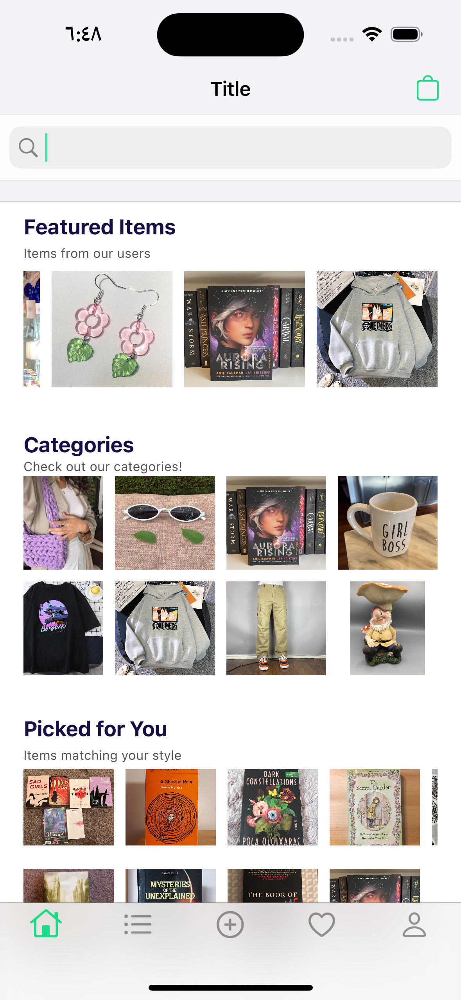

# Refur
Refur is a mobile app that provides a marketplace for buying and selling used items, similar to eBay. With Refur, users can browse and search for a wide range of items, from clothing to books and household goods. They can also create listings to sell their own items, using photos and descriptions to showcase their products and set prices.

> Home page
>
> 

## Features

 - Browse and search for used items from a variety of categories.
 - Create listings to sell your own used items, with photos and descriptions.
 - Set prices for your items and negotiate with potential buyers.
 - Communicate with buyers and sellers through a messaging system.

## Getting Started

To use Refur, you will need to download the app from the App Store. Once you have installed the app, you can sign up for an account and start browsing or creating listings.

## Technologies Used

Refur is built using XCode for the front-end and Firebase for the back-end. The app also uses various third-party libraries and APIs to provide features such as image uploading and messaging.

## Contributing

If you would like to contribute to Refur, you can fork the project and submit a pull request with your changes. Please make sure to follow the project's coding standards and documentation guidelines.

## License

Refur is released under the MIT license. See LICENSE for more details.

## Contact

If you have any questions or feedback about Refur, you can contact the project owner at [eamil](mailto:ahmed96s@hotmail.com).
